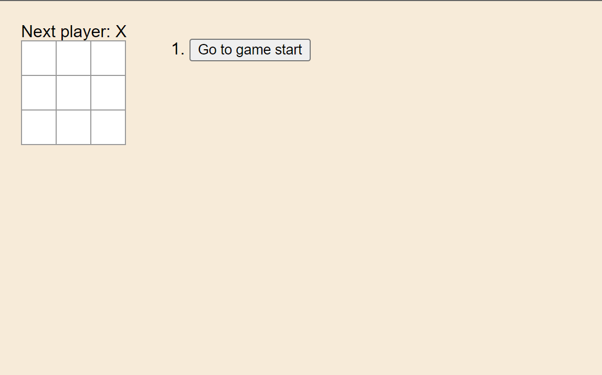
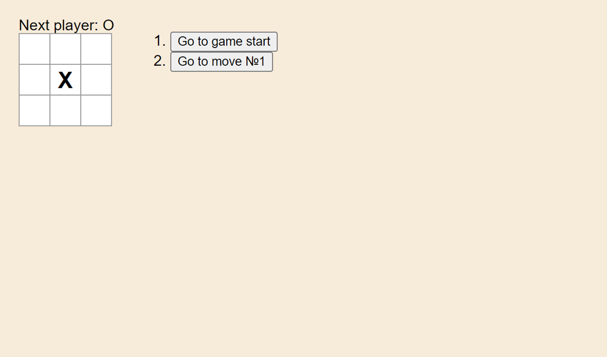
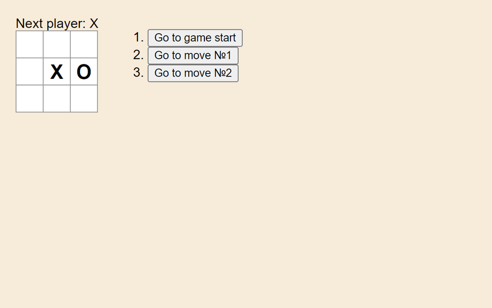
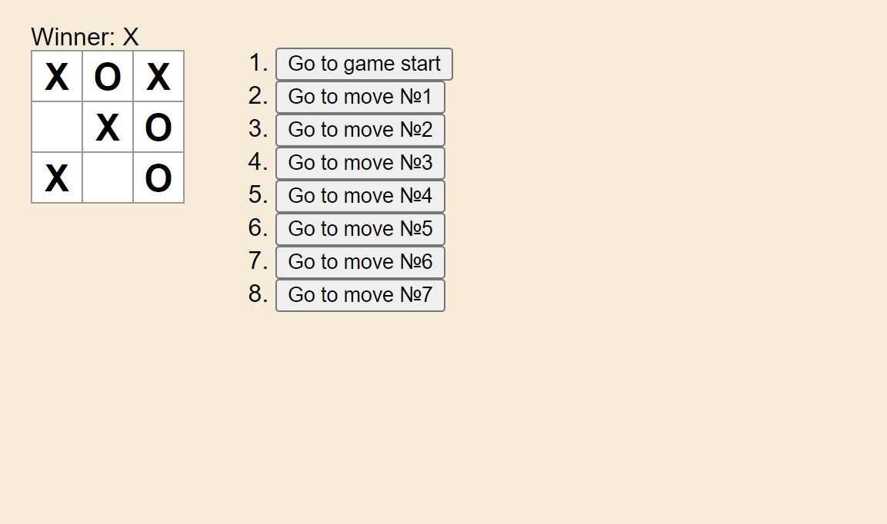
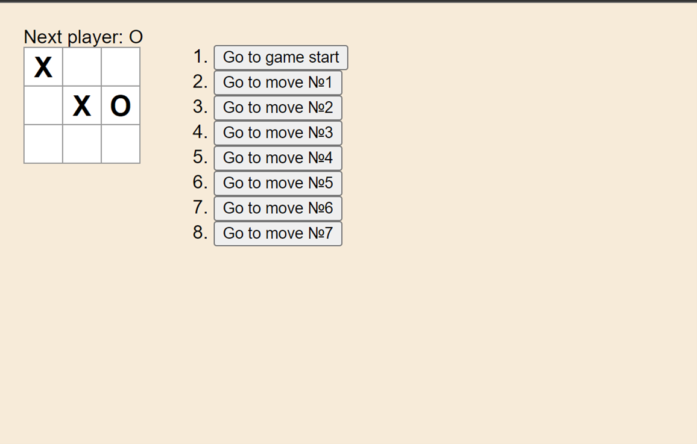

# Criss Cross geme

You can try game here [Criss-Cross](https://dkcodec.github.io/Criss-Cross_Game/)

## What I used?

This project was created with [React Dev Tutorial](https://react.dev/learn/tutorial-tic-tac-toe).

Also to learn React [React documentation](https://reactjs.org/).

### Feature

#### Whose turn is it now

A little block above game board for next turn

#### Move history

After each move will appear a buttons for checking previous moves

#### Who won

Break the game if someone win and show winner

### Examples

#### Game start

#### After 1st move

#### After 2nd move

#### X - won

#### Check previous move(3d move)

### Deployment

Deployed by GitHub Pages
This section has moved here: [https://facebook.github.io/create-react-app/docs/deployment](https://facebook.github.io/create-react-app/docs/deployment)
